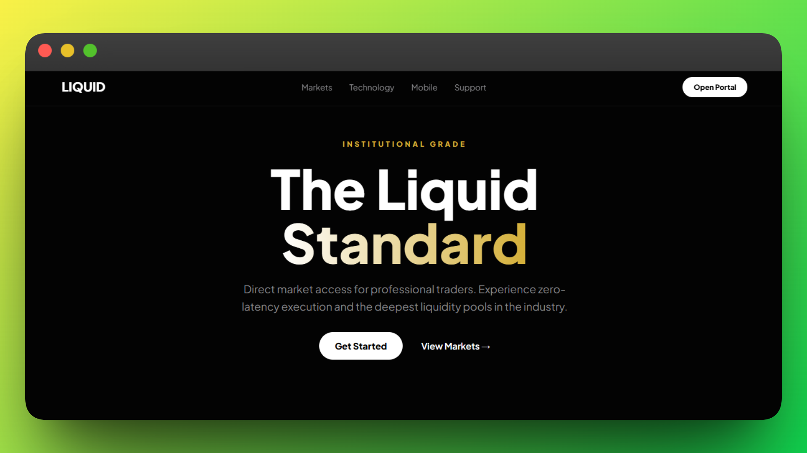

# Liquid



## Overview

Liquid is a premium single-page landing page for a fictional institutional trading platform. It is designed as a bold front-end concept with a dark visual theme, gold accents, animated sections, and interactive motion effects that communicate speed, scale, and a high-end financial brand.

## Features

- **Hero Experience:** Animated heading, subtext, and CTA area for the landing section.
- **Liquid Background:** Canvas particles create a subtle floating premium backdrop.
- **Brand Marquee:** Infinite scrolling institutional brand strip below the hero.
- **Pricing Tiers:** Retail, Pro, and Institutional packages presented as pricing cards.
- **Stats Section:** Key trading metrics styled for strong visual emphasis.

## Tech Stack

- **HTML**: Page structure and content
- **CSSs**: Custom styling, layout, glassmorphism, and responsive design
- **JavaScript**: Interactivity and DOM behavior
- **GSAP**: Entrance, scroll, and staggered animationss

## Getting Started

This is a static front-end project, so no build setup is required.

### Prerequisites

- A modern web browser
- An internet connection for loading GSAP and Google Fonts from CDNs

## Installation

1. **Clone the repository**

   ```bash
   git clone https://github.com/udayxgoel/Liquid.git
   cd Liquid
   ```

2. **Open the project**

   You can open `index.html` directly in the browser, or use a local live server for a smoother development workflow.

3. **Run with a local server**

   If you use VS Code, the easiest option is the Live Server extension.

## Usage

### Main Files

- `index.html` - overall page structure and content
- `styles.css` - theme, layout, responsive styling, and component presentation
- `script.js` - canvas animation, GSAP effects, card tilt, FAQ toggle, and parallax behavior

## License

No license file is currently present in this repository.
